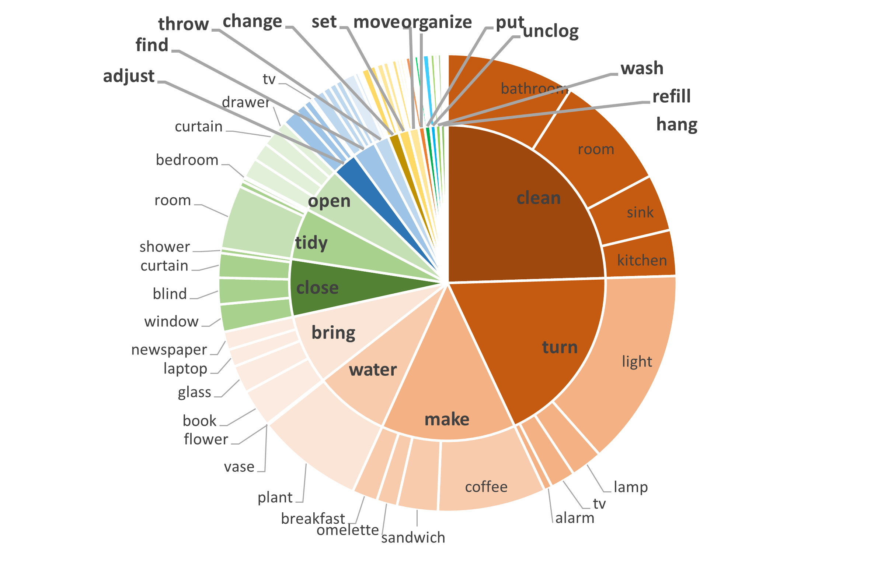

<div align="center">


# TaPA
</div>

# TaPA
Official implementation of [Embodied Task Planning with Large Language Models](https://arxiv.org/abs/2307.01848).

Try out the web demo 🤗 of **TaPA**: [](https://huggingface.co/spaces/xuxw98/TAPA)

The repository contains:
- The [15K data](#data-release) used for fine-tuning the model.
- The code for [generating the data](#data-generation-process).
- The code for [fine-tuning the model](#fine-tuning) on RTX 3090 GPUs with [Lit-LLaMA](https://github.com/Lightning-AI/lit-llama).
- The code for [inference](#Running-the-inference) during navigation.

## News
- **[2023.07.04]**  The **training code** for **TaPA** are released. 📌

## Overview

The pipeline of our embodied task planning framwork. We first collect multiple RGB
images in different achivable standing points and views, and utilize an open-voculary detector to
generate the list of existing objects in the scene. With the human instructions and predicted object
list, our TaPA can generate executable action plans for subsequent navigation or manipulation robots.

<div align="center">
  
</div>

## Setup
Here is a from-scratch script for **TaPA**.
```bash
# Install Lit-LLaMA
conda create -n tapa python=3.10
conda activate tapa
git clone https://github.com/Gary3410/TaPA.git
cd TaPA
pip install -r requirements.txt
# If you want to utilize more than one GPU
pip install deepspeed
```

<details>
<summary> <strong> If you have problems with the installation, you can follow these steps </strong> </summary>

1. conda create -n tapa python=3.10
2. conda activate tapa
3. git clone https://github.com/Gary3410/tapa
4. cd TaPA
5. pip install torch==2.0.0+cu117 torchvision==0.15.1+cu117 torchaudio==2.0.1 --index-url https://download.pytorch.org/whl/cu117
6. pip install sentencepiece
7. pip install tqdm
8. pip install numpy
9. pip install jsonargparse[signatures]
10. pip install bitsandbytes
11. pip install datasets
12. pip install zstandard
13. pip install lightning==2.1.0.dev0
14. pip install deepspeed

</details>

```bash
# Install Detic
# Exit the TaPA file first
cd ..
git clone git@github.com:facebookresearch/detectron2.git
cd detectron2
pip install -e .

cd ..
git clone https://github.com/facebookresearch/Detic.git --recurse-submodules
cd Detic
pip install -r requirements.txt
```
**Note:** If you have any problems with the installation, you can refer to [Detic_INSTALL.md](https://github.com/facebookresearch/Detic/blob/main/docs/INSTALL.md)
Meanwhile, you also need to download the appropriate pre-trained model and put the weights into the ``models`` folder.

Once the installation is complete, we need to copy the files from **Detic** to the **tapa** directory.

The TaPA file directory should be:
```
TaPA
├── checkpoints
│   ├── lit-llama
│   ├── llama
├── configs 
├── create_dataset
├── data
├── datasets
├── detic
├── docs
├── evaluate
├── finetune
├── generate
├── howto
├── lit-llama
├── models
│   ├── Detic_LCOCOI21k_CLIP_SwinB_896b32_4x_ft4x_max-size.pth
├── pretrain
├── quantize
├── scripts
├── tests
├── third_party
│   ├── CenterNet2
│   ├── Deformable-DETR
├── tools
......
```
If you want to make your own dataset, please install the openAI API and AI2-THOR.
```bash
# Install OpenAI API
pip install openai
# If there is a communication error, please try
pip install urllib3==1.25.11

# Install AI2THOR
pip install ai2thor

# If this is your first installation, please run
python prepare_thor.py
# to download the necessary scene resources
```
For more details on the installation and usage of AI2-THOR, please visit [AI2-THOR](https://github.com/allenai/ai2thor).


## Data Release
[`alpaca_15k_instruction.json`](./data/alpaca/alpaca_15k_instruction.json) contains 15K instruction-following data we used for fine-tuning the LLaMA-7B model.

The format is the same as [Aplaca](https://github.com/tatsu-lab/stanford_alpaca#data-release). Each dictionary contains the following fields:

- `instruction`: `str`, instructions given by the user, e.g., Please give me a cup of coffee.
- `input`: `str`, categories of objects contained in the scene. 
- `output`: `str`, the step-by-step actions to the instruction as generated by `gpt-3.5-turbo-0301`.

As for the prompts, we used the prompts proposed by [Alpaca](https://github.com/tatsu-lab/stanford_alpaca#data-release) directly.

Of course, we can also modify the prompts from [Alpaca](https://github.com/tatsu-lab/stanford_alpaca#data-release) a bit, such as:
```
 Below is an instruction that describes a task, paired with an input that provides further context. Write a response that appropriately completes the request and list each step to finish the instruction.
 
 ### Instruction:
 {instruction}
 
 ### Input:
 {input}
 
 ### Response:
```
Training and inference stages keep the same prompts.

## Data Generation Process
This is an example of making a dataset in AI2THOR.

If you need to make your own dataset, the easiest way is to modify the way the object list is generated.
```bash
# Create object list from AI2THOR scenes
cd create_dataset
python create_scene_obj_list.py
python create_json_data.py
python create_gpt_respond.py
python prase_json_2_alpaca.py
```
After running the above code, you will get the file `alpaca_15k_instruction.json` which contains almost 15K instructions.

We performed preliminary statistics on the dataset and found that the instructions generated by GPT-3.5 are more diverse and complex.

We plot the following graph to show the diversity of our data, with the inner circle being the root verb in the instruction and the outer circle representing the direct object in the instruction.

Meanwhile, we also count the average number of actions required by the Top7 instructions to demonstrate the complexity.

[//]: # (![parse_analysis]&#40;assert/parse_analysis.png | width=100&#41;)
[](./howto/figure/tapa_v4.png)

## Fine-tuning
We fine-tune the LLaMA-7B model on `alpaca_15k_instruction.json` according to the script provided by [Lit-LLaMA](https://github.com/Lightning-AI/lit-llama).

### Prepare LLaMA-7B model
Please request access to the pre-trained LLaMA from [this form](https://forms.gle/jk851eBVbX1m5TAv5) (official) or download the LLaMA-7B from [Hugging Face](https://huggingface.co/nyanko7/LLaMA-7B/tree/main) (unofficial).

Then, put them in the `checkpoints` directory.
```
TaPA
├── checkpoints
│   ├── lit-llama
│   ├── llama
│   │   ├── 7B
│   │   │   ├── checklist.chk
│   │   │   ├── consolidated.00.pth
│   │   │   ├── params.json
│   │   ├── tokenizer.model

```
Convert the weights to the Lit-LLaMA format:
```bash
python scripts/convert_checkpoint.py --model_size 7B
```
Once converted, you should have a folder like this:
```
TaPA
├── checkpoints
│   ├── lit-llama
│   │   ├── 7B
│   │   │   ├── lit-llama.pth
│   │   ├── tokenizer.model
│   ├── llama
│   │   ├── 7B
│   │   │   ├── checklist.chk
│   │   │   ├── consolidated.00.pth
│   │   │   ├── params.json
│   │   ├── tokenizer.model

```

### Prepare dataset
Generate the Alpaca format instruction tuning dataset:
```bash
python scripts/prepare_alpaca.py
```

### Running the finetuning
The finetuning requires at least one GPU with ~24 GB memory (RTX 3090). You can speed up training by setting the devices variable in the script to utilize more GPUs if available.

Here are some parameter settings.
```bash
devices = 2
micro_batch_size = 8

# GPU memory limit
devices = 8
micro_batch_size = 2
```
```bash
# Use 2 GPUs
CUDA_VISIBLE_DEVICES=0,1 python finetune/adapter.py
# Use 8 GPUs
CUDA_VISIBLE_DEVICES=0,1,2,3,4,5,6,7 python finetune/adapter.py
```

### Running the inference
You can test the finetuned model with your own instructions by running:
```bash
python generate/adapter_robot.py \
    --prompt "Can you prepare me a sandwich?" \
    --quantize llm.int8 \
    --max_new_tokens 512 \
    --input "[Cabinet, PaperTowelRoll, Cup, ButterKnife, Shelf, Bowl, Fridge, CounterTop, Drawer, Potato, DishSponge, Bread, Statue, Spoon, SoapBottle, ShelvingUnit, HousePlant, Sink, Fork, Spatula, GarbageCan, Plate, Pot, Blinds, Kettle, Lettuce,Stool, Vase, Tomato, Mug, StoveBurner, StoveKnob, CoffeeMachine, LightSwitch, Toaster, Microwave, Ladle, SaltShaker, Apple, PepperShaker]"
```
You can also take several scene images and save them to  `./input/rgb_img` directory and use Detic to generate a list of scene objects.
```bash
python generate/adapter_with_detic.py \
    --prompt "Can you open the computer?" \
    --max_new_tokens 512 \
    --img_path input/rgb_img
```

### Running the validation
If you want to try to get results on the validation set, need to prepare the validation set first.

```bash
# Creating multi-modal validation set
python create_partial_vision_dataset.py
python create_vision_dataset.py
```
The default validation set instructions are stored in [alpaca_20_val_instruction.json](./data/alpaca/alpaca_20_val_instruction.json).

If you want to create your own validation set, you can perform the dataset generation process again based on [alpaca_20_val.json](./create_dataset/alpaca_20_val.json)

Once the validation set generation is complete, run:
```bash
python generate/adapter_detic_robot_eval_random.py --navigation_strategy Select one of the random strategies
python generate/adapter_detic_robot_eval_traversal.py --navigation_strategy Select one of the traversal strategies
```

### Omnigibson preparation
```bash
python docker_build.py
./run_docker.sh -h <ABS_DATA_PATH>
```

## Contributors
All grad students below contributed equally and the order is determined by random draw.
- [Ziwei Wang](https://ziweiwangthu.github.io/)
- [Xiuwei Xu](https://xuxw98.github.io/)
- [Zhenyu Wu](https://gary3410.github.io/)
- [Guanxing Lu](https://guanxinglu.github.io/)
 
All advised by [Jiwen Lu](http://ivg.au.tsinghua.edu.cn/Jiwen_Lu/). Zhenyu Wu is also advised by [Haibin Yan](https://scholar.google.com/citations?user=-AQLKlsAAAAJ).
## Acknowledgement
This repo benefits from [AI2THOR](https://github.com/allenai/ai2thor), [LLaMA](https://github.com/facebookresearch/llama), [Stanford Alpaca](https://github.com/tatsu-lab/stanford_alpaca), [Detic](https://github.com/facebookresearch/Detic), and [Lit-LLaMA](https://github.com/Lightning-AI/lit-llama). Thanks for their wonderful works.
